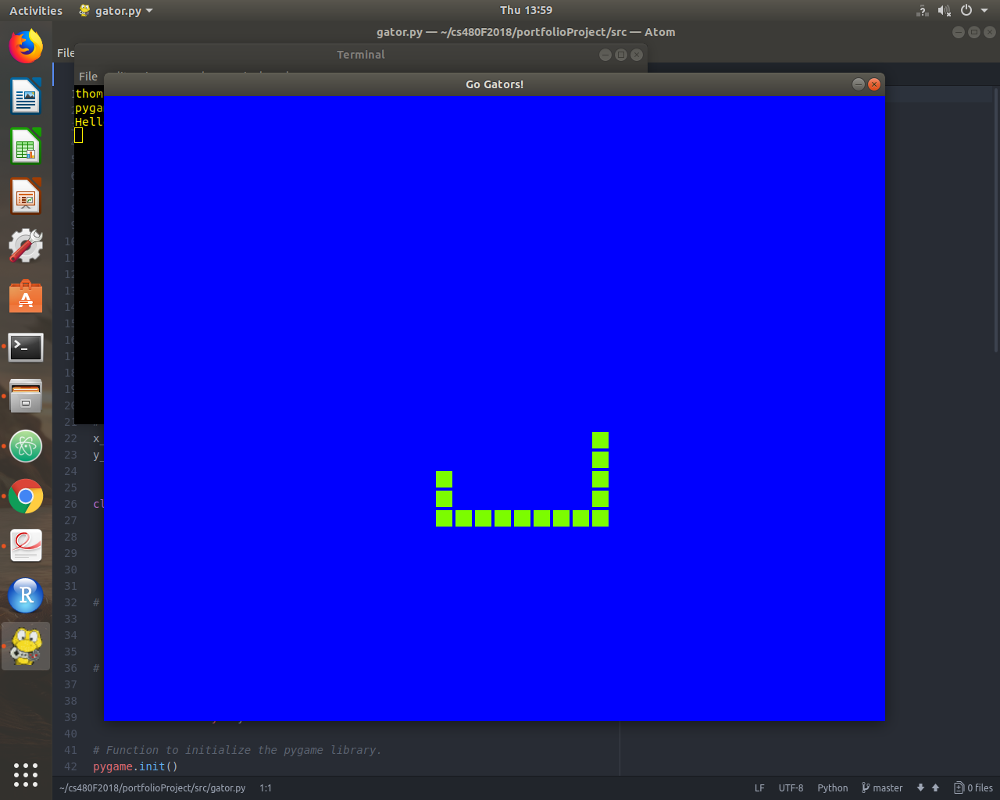

# Dillon Thoma

## Project Name and Description

This project, `gator.py` creates a pop-up window on the screen of a set size and enters a green gator swimming through a blue body of water. The game simply allows the user to control the movements of the gator around the screen, imitating a gator swimming through a swamp. Additionally, I may try to add some functions that allow the gator to grow if it eats little fish, or die if it crashes into rocks or itself. This was my first time using Pygame, and although the program is somewhat simple, I enjoyed creating it and hope to learn more about the package in the future to create more in-depth Pygame programs.

## How to Build and Run the Project

python3 gator.py

## How to Test the Application

Testing the application can be done using the `.travis.yml` file that checks the style and syntax of the program. The Travis CI build will ensure the program has the correct style and syntax, and that it builds and runs correctly.

## Software Tools Used

The first and main software tool I used to create this project was Atom. I used Atom as my text editor to put my code into, and have a fully functioning program as a result. Additionally, I used GitHub to commit and push my work to a repository that stores all of my code, writing, and changes to the program. I also used a software tool known as Travis CI that checks the correctness of my program base on a given style guide. The style guide I used was implemented via Travis, and was the default one when creating a .travis.yml file for my code.

## Tangible Results

So far, my program allows the user to play a basic game that uses the arrow keys to control the movement of a virtual gator around a virtual body of water. In the future, I will be able to add some more features that might do things like allow the gator to grow or kill the program if it crashes into itself or the border. I had attempted to implement some of these things, but my knowledge in Pygame is not advanced enough for some of these. I will continue to learn and implement new features to this program as time goes on.

